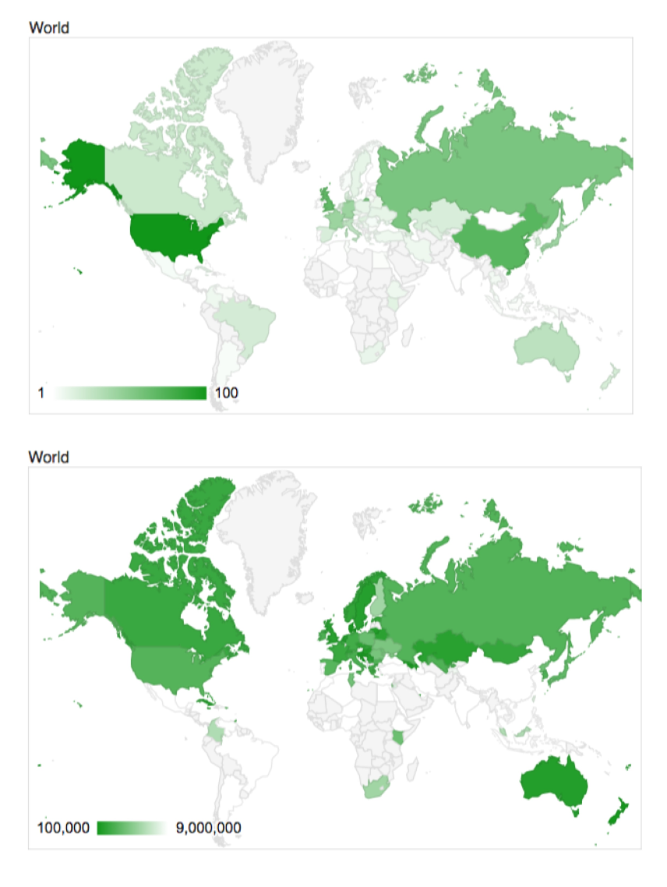

## Coursework Brief: 
The Olympic Games have always mixed pure sporting spectacle with national competition. During the Cold War the USA and the Soviet Union competed fiercely to win the most medals in each games. On a somewhat milder level, in Britain we often compare our medal count with that of Australia, one of our traditional sporting rivals. If you were in the UK during the summers of 2012 and 2016 you cannot have missed the excitement caused by the UK's success relative to previous years.
This competition is usually expressed in terms of the number of medals won by each country's athletes (Figure 1 top panel). However, many interested watchers, especially those from smaller countries, have pointed out that the medal table is hardly a fair reflection of a country's sporting prowess. Some countries have a strong tradition of sporting excellence, but are simply too small to make an impact in terms of total medals. These commentators would rather look at the per capita medal count (Figure 1 bottom panel).
```{r echo=FALSE, out.width='50%', fig.align='center'}

```
Figure 1: Total medals per country (top) and medals per capita (bottom) in the Rio 2016 Olympic Games (credit: http://www.medalspercapita.com/)

Looking at the per capita map above though, we see that large areas of the world are still very under-represented. Specifically, poorer countries do not win many medals per head of population. There are many reasons for this, including a lack of investment in sport and facilities, and fewer individuals who are wealthy enough to devote their life to training. As such, it has been suggested that we should compensate for wealth when measuring a country's Olympic performance.
In this coursework, we will investigate how the number of medals a country wins can be predicted from national population and/or GDP, and how consistent these relationships are, using R. Respect the academic integrity statement and avoid plagiarism.
Begin by downloading the data file medal_pop_gdp_data_statlearn.csv from Minerva.

This data file contains the following information for 71 countries (those that won at least one gold medal in each of the last three games):

- Country name (as recognised by the IOC)
- Population
- GDP (in billions of US dollars)
- Medals won in Beijing 2008, London 2012 and Rio 2016


## Task 1: Use Population and GDP as inputs and medal count in 2012 Olympics as outputs for linear regression model.
We will use **glm()** function to fit a linear regression model instead of lm() function because our data is not normally distributed. We will use the following code to fit the model and summarise it.
```{r}
# Load the data
data <- read.csv("medal_pop_gdp_data_statlearn.csv")
# Fit a linear regression model
model_1 <- glm(Medal2012 ~ Population + GDP, data = data)
# Summarise the model
summary(model_1)
```


## Task 2: Repeat task 1 for log-transformed outputs. Discuss potential benefits and reasons for using the transformation.
We will use **log()** function to transform the Output variable (Medal2012) to fit our model. The log transformation has the following benefits:

- **Reduces skewness:** A lot of datasets, especially those involving numbers or money (like population sizes, incomes, or counts of items like medals), are right-skewed. Log transformation can help reduce this skewness, making the data more symmetric and thus fitting the linear model better.
- **Stabilizes variance:** Log transformation can help stabilize the variance across the range of data, which improves the efficiency of regression estimates.
- **Handles outliers:** Log transformation can reduce the effect of outliers by compressing large values more than smaller values, thus diminishing the influence of extreme values on the model fitting.
```{r}
# Fit a linear regression model
model_2 <- glm(log(Medal2012) ~ Population + GDP, data = data)
# Summarise the model
summary(model_2)
```

### Comparisons of Log-Transformation (Output 2) Over Raw Counts (Output 1):
With the log transformation, the model shows **significant improvements** in several aspects compared to the raw count model:

- **Improved Model Fit:** Lower AIC and Residual Deviance in Output 2 shows that the log model captures the underlying patterns more effectively.
- **Stabilized Variance:** As expected, the lower dispersion parameter in Output 2 shows that log transformation helps in stabilizing the variance across data points.
- **Better Handling of Scale and Outliers:** The log transformation normalizes the scale of the response variable, reducing the impact of outliers and large scale discrepancies among observations.
- **Statistical Significance and Coefficients:** GDP shows a consistent, significant positive effect on medal counts in both models, highlighting its importance as a predictor (input). Population remains insignificant in both models, suggesting that simply having a larger population does not necessarily predict more medals, which could be due to factors like the quality of sports infrastructure, athlete training, and resource allocation which are not captured merely by population size.


## Task 3: List relevant properties of the outputs. Develop and explain your own regression model that uses the same inputs and outputs from task 1 but is different from the models in tasks 1 and 2. Justify your choice and discuss how your model takes into account the listed properties. Discuss potential benefits of your approach compared to models 1 and 2. Learn the parameters of your model based on the data used in task 1.

### Relevant Properties of Outputs:
1. **Residual Deviance:** Measures the goodness of fit of the model to the data. Lower values indicate a better fit.
2. **Dispersion Parameter:** Reflects the variance of the residuals around the fitted values. Smaller values suggest more homoscedasticity (constant variance).
3. **AIC (Akaike Information Criterion):** Balances the trade-off between model complexity and goodness of fit. Lower AIC values indicate a better model fit.
4. **Coefficient Significance:** Indicates the statistical significance of predictor (input) variables. Significant coefficients imply a meaningful relationship between predictors and the response variable.

### Own Regression Model: Negative Binomial
We will first inspect the nature and the spread of the dataset.
```{r}
summary(data)
hist(data$Medal2012, main = "Histogram of Medals in 2012", xlab = "Medals in 2012")
```

From the summary of the data, we can see that there is **no zero** value for Medal2012, which is expected for Olympic medal counts. The histogram also shows a **right-skewed** distribution, which might benefit from a log transformation to stabilize variance and improve model fit. But here, we will use own **Negative Binomial** model since it can also help us with the **overdispersion** (variable significantly larger than the mean) in the data.

### Benefits Over Previous Models:
**Accommodation of Overdispersion:** Provides more reliable standard errors and statistical inferences for overdispersed count data than a standard linear regression model.

**Direct Interpretation:** No need for back-transformation as in log-linear models; model output is in the original count scale, which simplifies interpretation.

**Flexibility:** Can model a wider range of data distributions, which is beneficial for skewed count data such as Olympic medal counts.

**Predictive Accuracy:** Likely to offer better predictive accuracy for count data due to its accommodation of overdispersion and non-linearity.

Now, we will fit the Negative Binomial model to the data. we will use the **glm.nb()** function from the **MASS** package to fit the model.

```{r}
# Assuming the 'MASS' package is installed and 'data' is your dataset
library(MASS)

# Fit a Negative Binomial model
model_3 <- glm.nb(Medal2012 ~ Population + GDP, data = data)

# Summarize the model
summary(model_3)
```


## Task 4: Carry out model selection using AIC to determine which model from tasks 1 to 3 performs best. In addition to using AIC, analyse and inspect the models to determine which model would you choose to accurately predict the medal count. Report your results. Justify your reasoning and choice.

```{r}
# Model selection using AIC
AIC(model_1, model_2, model_3)
```

We summarized the necessary information from the models in table 1 to make an informed decision. We will compare the models based on the following criteria:

1. **AIC Comparison:** Lower AIC values indicate a better balance of model complexity and goodness of fit.

2. **Model Fit:** Residual Deviance and Dispersion Parameter help assess the model's fit to the data. The **ideal** residual deviance should be as close as to the degrees of freedom, and the dispersion parameter should be close to 1 for a good fit.

```{r table1, echo=FALSE}
library(knitr)
df <- data.frame(
  ` ` = c("AIC Value", "Residual Deviance (on 68 degrees of freedom)", "Dispersion Parameter"),
  `Model 1` = c(553.1870, 8986.6, 132.1562),
  `Model 2` = c(201.8528, 63.760, 0.9376449),
  `Model 3` = c(475.9745, 72.69, 1)
)
names(df) <- c("", "Model 1", "Model 2", "Model 3")
kable(df, caption = "Model Comparison")
```

### Interpretation of Results
Based on the AIC values, Model 2 (Log-Transformed Linear Model) has the lowest AIC, indicating it is the best fit model among those compared. The Residual Deviance and Dispersion Parameter also suggest that Model 2 fits the data better than the other models.

**Model 2** is likely the best model in terms of fitting the data while accounting for overdispersion (indicated by the dispersion parameter close to 1).
**Model 3** is a close second and might be more appropriate if the count nature of the data and potential overdispersion are of primary concern, despite its slightly higher residual deviance compared to Model 2.


## Task 5: Using the model from task 4, derive and compute the probability that the UK wins at least one medal given the estimated model parameters.
From our task 4, we choose to use the model from task 2 (Model 2: Log-Transformed Linear Model) to predict the probability that the UK wins at least one medal. We use the model to predict the probability of winning at least one medal for the UK, with a population of 66.65 million and a GDP of 2.62 trillion USD.

$$log(\text{Medal2012}) = \text{Intercept} + (\text{Population Coefficient} \times \text{Population}) + (\text{GDP Coefficient} \times \text{GDP})$$


We also have the following model parameters from Model 2:

- Intercept: 1.569

- Population Coefficient: 1.105e-10

- GDP Coefficient: 3.161e-4

```{r}
# Model parameters from Model 2
intercept <- 1.569
population_coeff <- 1.105e-10
gdp_coeff <- 3.161e-4

# Great Britain's GDP in billions and Population
gdp_gb <- 2431.59
population_gb <- 62262000

# Calculate the log of the expected number of medals for Great Britain
log_lambda_gb <- intercept + (population_coeff * population_gb) + (gdp_coeff * gdp_gb)

# Calculate the expected number of medals (lambda) by taking the exponential
# Since the outcome of the model is the log of the medal count, we exponentiate 
# the result to get the actual predicted medal count.

#predicted_medal_count
lambda_gb <- exp(log_lambda_gb)

# Calculate the probability of winning at least one medal
probability_at_least_one_gb <- 1 - exp(-lambda_gb)

# Print the expected number of medals and the probability
print(paste("Expected number of medals:", lambda_gb))
print(paste("Probability of winning at least one medal:", probability_at_least_one_gb))
```

We predict that Great Britain is expected to win atleast 10.4 medals based on the model.

Note that, as per the data, Great Britain has won 65 medals in the 2012 Olympics. But the model predicted 10.4 medals for Great Britain in the 2012 Olympics. This discrepancy could be due to various factors not accounted for in the model, such as investment in sports infrastructure, athlete training programs, or even socio-political factors during the Olympic year.

Thus, the probability of winning at least one medal is **99.99%**, indicating a strong likelihood of success for Great Britain in the Olympics.